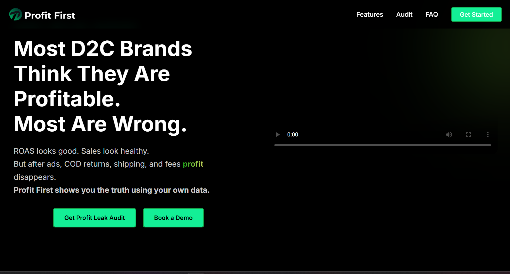

# Profit First - Design System & Brand Guidelines

This document outlines the complete design system, color palette, and UI patterns used in the Profit First landing page. Use this as a reference when creating new pages or components to maintain brand consistency.

---

## 🎨 Color Palette

### Primary Colors

| Color Name | Hex Code | RGB | Usage |
|------------|----------|-----|-------|
| **Primary Green** | `#13ef96` / `#12EB8E` | rgb(19, 239, 150) | Primary CTA buttons, accents, highlights |
| **Dark Green** | `#16a34a` | rgb(22, 163, 74) | Button borders, secondary accents |
| **Lime Green** | `#04b669e6` | rgb(4, 182, 105, 0.9) | Gradient backgrounds, overlays |

### Background Colors

| Color Name | Hex Code | Usage |
|------------|----------|-------|
| **Primary Background** | `#000000` / `#000703` | Main page background (black) |
| **Card Background** | `#161616` | Cards, sections, containers |
| **Secondary Background** | `#1e1e1e` | Modal backgrounds, secondary containers |
| **Tertiary Background** | `#0D1B1D` | Special boxes (Shopify integration boxes) |

### Text Colors

| Color Name | Hex Code | Usage |
|------------|----------|-------|
| **Primary Text** | `#FFFFFF` | Main headings, body text |
| **Secondary Text** | `#gray-300` / `#gray-400` | Subtext, descriptions |
| **Muted Text** | `rgba(255, 255, 255, 0.8)` | Less important text |

### Accent & Status Colors

| Color Name | Hex Code | Usage |
|------------|----------|-------|
| **Success Green** | `#10b981` / `#34d399` | Success states, checkmarks |
| **Blue** | `#155ff2` | Sales metrics |
| **Purple** | `#8b0df2` | Shipping metrics |
| **Cyan** | `#12e8e5` | Ads metrics |
| **Orange** | `#edaf71` | Cost metrics |

---

## 🌈 Gradients

### Primary Gradient (Text & Accents)
```css
background: linear-gradient(to right, rgb(29, 164, 24), rgb(206, 220, 93));
```
**Usage:** Highlighted text, special emphasis words
**CSS Class:** `.my-gradient-text`

### Blur Circle Gradients (Background Effects)
```css
/* Top Right Circle */
background: linear-gradient(to right, rgb(29, 164, 24), rgb(206, 220, 93));
opacity: 0.5;
blur: 100px;

/* Bottom Left Circle */
background: linear-gradient(to left, rgb(29, 164, 24), rgb(206, 220, 93));
opacity: 0.5;
blur: 100px;
```
**Usage:** Hero section background blur effects

### Contact Gradient
```css
background: linear-gradient(to bottom right, #04b669e6, #000703);
```
**CSS Class:** `.my-gradient-contact`

### Diamond Shine Effect
```css
background: linear-gradient(
  90deg,
  #10b981 0%,
  #34d399 20%,
  #ffffff 40%,
  #34d399 60%,
  #10b981 80%,
  #10b981 100%
);
background-size: 200% auto;
animation: diamond-shimmer 3s linear infinite;
```
**CSS Class:** `.diamond-shine`

---

## 🔘 Button Styles

### Primary CTA Button
```css
background-color: #13ef96;
color: #000000;
font-weight: 600;
padding: 12px 24px;
border-radius: 6px;
transition: all 0.3s ease;
```

### Professional Button (with hover effect)
```css
.btn-professional {
  background-color: #12EB8E;
  color: #000;
  border: 2px solid #16a34a;
  border-radius: 9999px;
  padding: 10px;
  font-weight: 600;
}

.btn-professional:hover {
  transform: scale(1.05);
  box-shadow: 0 8px 16px rgba(0, 0, 0, 0.15);
  color: #ffffff;
}
```

### Custom Glow Effect
```css
.custom-glow:hover {
  box-shadow: 0 0 25px #13e691;
}
```

---

## 📦 Component Patterns

### Glass Morphism Effect
```css
.glass {
  background: rgba(255, 255, 255, 0.15);
  backdrop-filter: blur(10px);
  -webkit-backdrop-filter: blur(10px);
  border: 1px solid rgba(255, 255, 255, 0.2);
  border-radius: 16px;
  box-shadow: 0 4px 30px rgba(0, 0, 0, 0.1);
}
```

### Card Style
```css
background-color: #161616;
border-radius: 12px;
padding: 16px;
box-shadow: 0 4px 6px rgba(0, 0, 0, 0.1);
```

### Shopify Integration Box
```css
.myshopifybox {
  background-color: #0D1B1D;
  box-shadow: 
    0px 24px 44px 0px #000000,
    inset 0px 0px 7px 1px #225757;
}
```

---

## ✨ Typography

### Font Family
```css
font-family: 'Inter', sans-serif;
```
**Import:** `@import url('https://fonts.googleapis.com/css2?family=Inter:wght@400;500;600;700&display=swap');`

### Heading Sizes
- **Hero Heading:** `text-3xl sm:text-4xl md:text-5xl` (30px → 36px → 48px)
- **Section Heading:** `text-2xl sm:text-3xl md:text-4xl` (24px → 30px → 36px)
- **Subheading:** `text-xl sm:text-2xl` (20px → 24px)
- **Body Text:** `text-base sm:text-lg` (16px → 18px)
- **Small Text:** `text-sm` (14px)

### Font Weights
- Regular: `400`
- Medium: `500`
- Semibold: `600`
- Bold: `700`

---

## 🎭 Animations

### Bounce In Animation
```css
@keyframes bounceIn {
  0% {
    opacity: 0;
    transform: scale(0.5) translateY(20px);
  }
  30% {
    transform: scale(1.1) translateY(-10px);
  }
  100% {
    transform: scale(1) translateY(0);
    opacity: 1;
  }
}
```

### Diamond Shimmer
```css
@keyframes diamond-shimmer {
  0% { background-position: 0% center; }
  100% { background-position: 200% center; }
}
```

### Marquee Animation
```css
@keyframes marqueee {
  0% { transform: translateX(100%); }
  100% { transform: translateX(-100%); }
}
```

### Fill Line (Progress Bar)
```css
@keyframes fillLine {
  from { width: 0%; }
  to { width: 100%; }
}
```

---

## 📐 Spacing & Layout

### Container Widths
- **Max Width:** `max-w-7xl` (1280px)
- **Content Width:** `max-w-2xl` (672px)
- **Text Width:** `max-w-xl` (576px)

### Padding Standards
- **Section Padding:** `py-12 px-4 md:px-12`
- **Hero Section:** `pt-32 pb-12 px-4 md:pt-64`
- **Card Padding:** `p-4` or `p-6`

### Border Radius
- **Small:** `rounded-md` (6px)
- **Medium:** `rounded-lg` (8px)
- **Large:** `rounded-xl` (12px)
- **Full:** `rounded-full` (9999px)

---

## 🖼️ Visual Effects

### Blur Effects
- **Background Circles:** `blur-[100px]`
- **Glass Effect:** `backdrop-filter: blur(10px)`

### Shadows
- **Card Shadow:** `shadow-md` or `shadow-lg`
- **Button Shadow:** `0 8px 16px rgba(0, 0, 0, 0.15)`
- **Shopify Box:** `0px 24px 44px 0px #000000`

### Opacity
- **Blur Circles:** `opacity-50`
- **Muted Elements:** `opacity-80`

---

## 🎯 Brand Voice & Messaging

### Key Phrases
- "Know how much you **spent** & how much **profit** you'll make"
- "Getting the Good **ROAS** but still don't know where your profit is **going?**"
- "Stay Connected on our **Newsletter**"

### Highlighted Words (use gradient)
- spent
- profit
- ROAS
- going
- Newsletter

---

## 📱 Responsive Breakpoints

```css
/* Mobile First Approach */
sm: 640px   /* Small devices */
md: 768px   /* Medium devices */
lg: 1024px  /* Large devices */
xl: 1280px  /* Extra large devices */
```

### Responsive Patterns
```jsx
className="text-sm sm:text-base md:text-lg"
className="px-2 sm:px-4 md:px-12"
className="hidden sm:block"
```

---

## 🔧 Utility Classes

### Custom Scrollbar
```css
.custom-scrollbar::-webkit-scrollbar {
  width: 12px;
}
.custom-scrollbar::-webkit-scrollbar-thumb {
  background-color: rgba(255, 255, 255, 0.3);
  border-radius: 9999px;
}
```

### Hide Scrollbar
```css
.hide-scrollbar::-webkit-scrollbar {
  display: none;
}
```

### Smooth Scroll
```css
html {
  scroll-behavior: smooth;
}
```

---

## 🎨 Quick Reference: Common Combinations

### Hero Section Pattern
```jsx
<section className="relative w-full flex flex-col items-center justify-center text-white pt-32 pb-12 px-4 md:pt-64">
  {/* Blur circles */}
  <div className="absolute top-0 right-0 w-64 h-64 rounded-full blur-[100px] opacity-50"
       style={{background: "linear-gradient(to right, rgb(29, 164, 24), rgb(206, 220, 93))"}} />
  
  {/* Content */}
  <h1 className="text-3xl sm:text-4xl md:text-5xl font-bold text-center mb-6">
    Your heading with <span className="my-gradient-text">highlighted</span> text
  </h1>
</section>
```

### Card Pattern
```jsx
<div className="bg-[#161616] rounded-lg shadow hover:shadow-lg transition p-4">
  {/* Card content */}
</div>
```

### CTA Button Pattern
```jsx
<Link to="/signup" 
      className="bg-[#13ef96] text-black font-medium px-6 py-3 rounded-md transition duration-300">
  Start your free trial
</Link>
```

---

## 📋 Checklist for New Pages

When creating a new page, ensure:

- [ ] Background is black (`#000000`)
- [ ] Text is white (`#FFFFFF`)
- [ ] Primary CTA uses green (`#13ef96`)
- [ ] Gradient text uses `.my-gradient-text` class
- [ ] Cards use `#161616` background
- [ ] Font is Inter
- [ ] Responsive classes are applied (sm:, md:, lg:)
- [ ] Blur circles for visual interest
- [ ] Smooth scroll enabled
- [ ] Proper spacing (py-12, px-4, etc.)
- [ ] Hover effects on interactive elements

---

## 🚀 Getting Started

To use this design system in a new folder:

1. Copy the color variables
2. Import Inter font
3. Set up Tailwind CSS
4. Copy the custom CSS classes from `App.css`
5. Follow the component patterns above
6. Use the responsive breakpoints consistently

---

**Last Updated:** February 2025  
**Version:** 1.0  
**Maintained by:** Profit First Team
